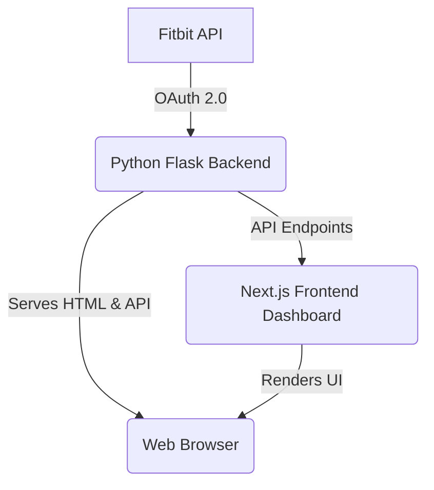

# Fitbitter

A simple Python Flask application to connect to the Fitbit API using OAuth 2.0 and integrate with your data.

## Prerequisites

- Python 3.10+
- A Python virtual environment: `/Users/martindevilliers/python/virt/bin/activate`

## Setup and Installation

1.  **Clone the repository:**
    ```bash
    git clone <repository-url>
    cd fitbitter
    ```

2.  **Activate the virtual environment:**
    ```bash
    source /Users/martindevilliers/python/virt/bin/activate
    ```

3.  **Install the dependencies:**
    ```bash
    pip install -r requirements.txt
    ```

## Fitbit Application Registration

To use this application, you need to register a new application on the Fitbit Developer site.

1.  Go to [https://dev.fitbit.com/](https://dev.fitbit.com/) and log in with your Fitbit account.
2.  Click on **"MANAGE" -> "Register An App"**.
3.  Fill out the application registration form:
    -   **Application Name:** `Fitbitter`
    -   **Description:** A simple app to view my Fitbit data.
    -   **Application Website:** `http://127.0.0.1:5001`
    -   **Organization:** Your name
    -   **Organization Website:** `http://127.0.0.1:5001`
    -   **OAuth 2.0 Application Type:** `Personal`
    -   **Callback URL:** `http://127.0.0.1:5001/callback`
    -   **Default Access Type:** `Read-Only`
4.  Agree to the terms and click **"Register"**.

You will now see your **"OAuth 2.0 Client ID"** and **"Client Secret"**.

## Configuration

1.  Create a `.env` file from `.env.example`:
    ```bash
    cp .env.example .env
    ```
2.  Update the `.env` file with your credentials:
    ```env
    FITBIT_CLIENT_ID='YOUR_CLIENT_ID'
    FITBIT_CLIENT_SECRET='YOUR_CLIENT_SECRET'
    FITBIT_REDIRECT_URI='http://127.0.0.1:5001/callback'
    CORS_ORIGIN='http://127.0.0.1:3000'
    FRONTEND_URL='http://127.0.0.1:3000'
    ```

## Running the Application

1.  Ensure your virtual environment is activated.
2.  Run the application using the module path:
    ```bash
    python -m fitbit_app.main
    ```
3.  Open your browser at `http://127.0.0.1:5001`.
4.  Login with Fitbit and authorize the application.

You should be redirected back to the application and see a list of your Fitbit devices as well as a few menu items for querying some data from Fitbit. 

## Dashboard

This app works well with a Next.js dashboard to showcase how to visualize your Fitbit data with more modern looking graphs.
The dashboard has moved to its own repository: https://github.com/waxman8/fitbitter-dashboard
It uses the python app here as its back-end for APIs including authentication and session/token management.


### Architecture Overview




